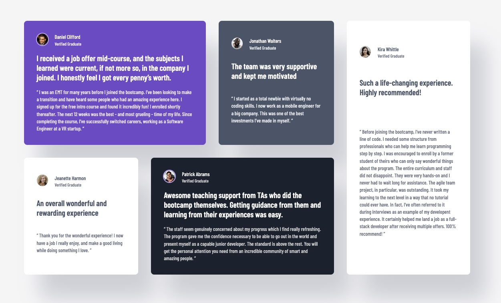

# Frontend Mentor - Testimonials grid section solution

This is a solution to the [Testimonials grid section challenge on Frontend Mentor](https://www.frontendmentor.io/challenges/testimonials-grid-section-Nnw6J7Un7). Frontend Mentor challenges help you improve your coding skills by building realistic projects.

## Table of contents

- [Overview](#overview)
  - [The challenge](#the-challenge)
  - [Screenshot](#screenshot)
  - [Links](#links)
- [My process](#my-process)
  - [Built with](#built-with)
  - [What I learned](#what-i-learned)
  - [Useful resources](#useful-resources)
- [Author](#author)

## Overview

### The challenge

Users should be able to:

- View the optimal layout for the site depending on their device's screen size

### Screenshot

### Links

- Solution URL: [Solution](https://github.com/vince4dev/challenge7)
- Live Site URL: [Live site](https://vince4dev.github.io/challenge7/)

## My process

### Built with

- Semantic HTML5 markup
- CSS custom properties
- Flexbox
- CSS Grid
- Mobile-first workflow

### What I learned

During this challenge I deepened my knowledge of CSS Grid, especially the grid‑area and grid‑template‑areas properties.

These tools let me:

- Define explicit grid layouts that adapt gracefully to different screen sizes.
- Re‑order elements on the fly by simply changing the grid-area names in the CSS, without touching the HTML.
- Create responsive designs with a single set of rules that shift from mobile to desktop by redefining the grid-template-areas block inside a media query.

In short, mastering grid‑area + grid‑template‑areas gave me a powerful and declarative way to build clean, flexible layouts that look great on any device.

### Useful resources

- [google-webfonts-helper](https://gwfh.mranftl.com/fonts) - This helped me find the font and integrate it into the project.
- [MDN](https://developer.mozilla.org/fr/) - Resources for Developers.

## Author

- Frontend Mentor - [@vince4dev](https://www.frontendmentor.io/profile/vince4dev)
